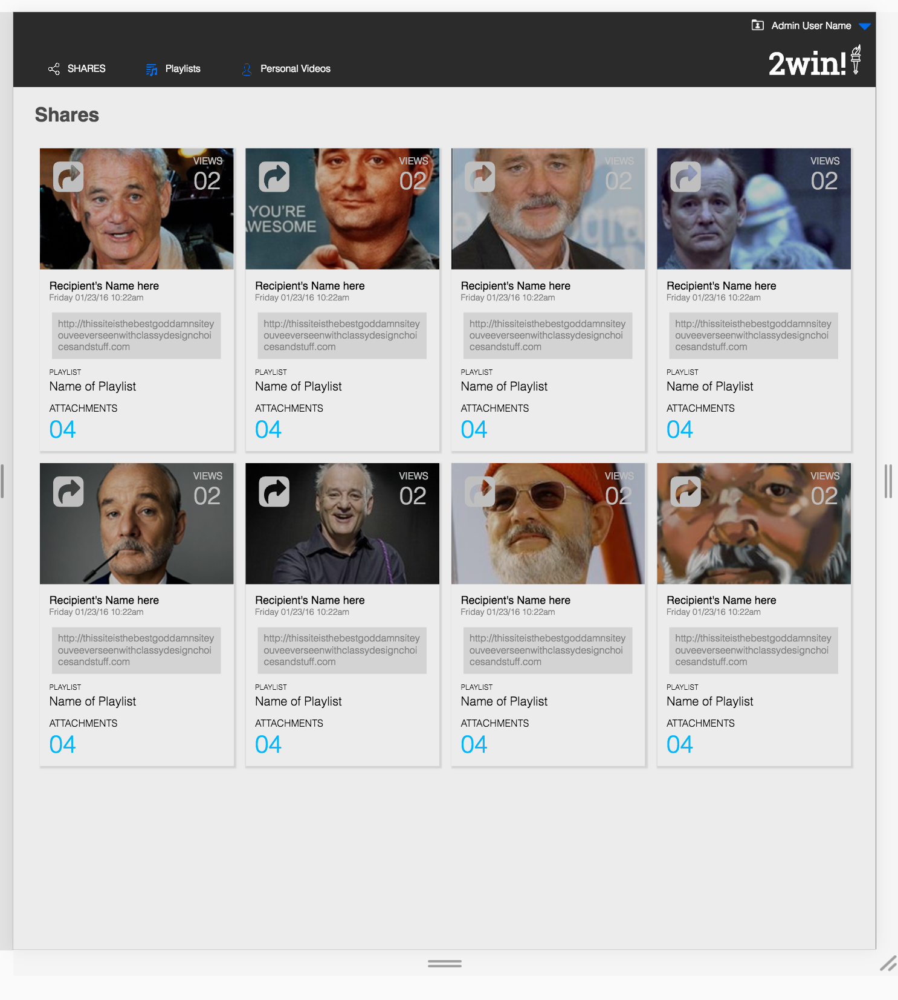

# Static Comp 2

## Assignment

The purpose of this comp was to use HTML and CSS to replicate a picture of a site as close as possible.  I was given no assets and only had a photo to go from.  I was given leeway in the images, icons, and copy, aiming to remain true to the design principles in the original comp.

)
